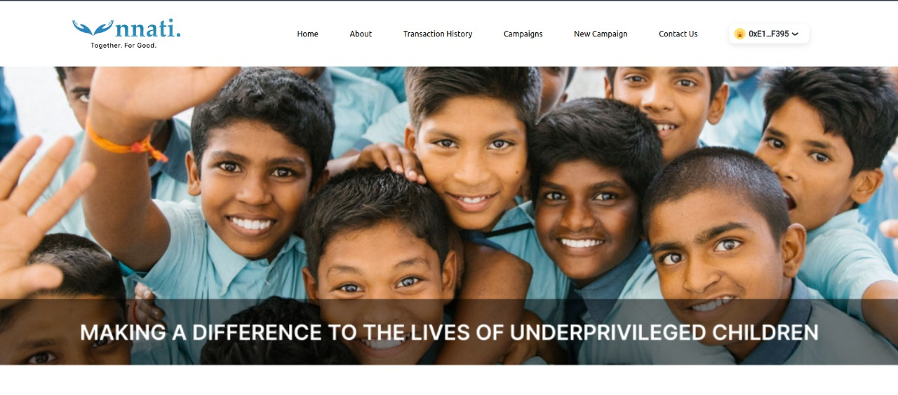
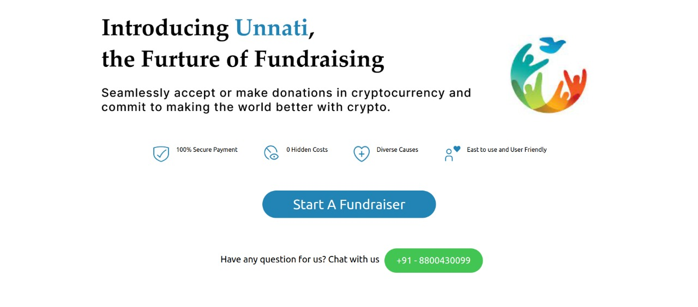
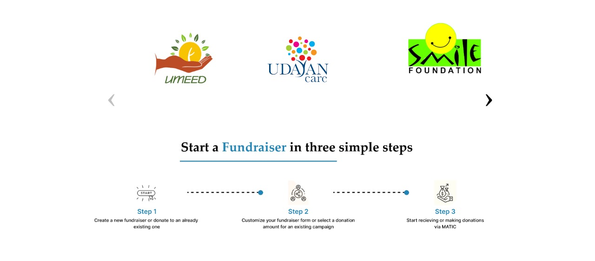
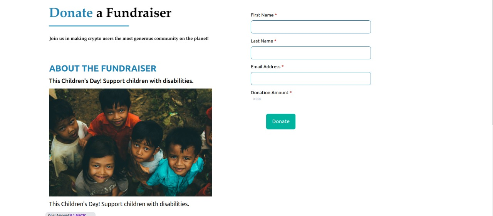
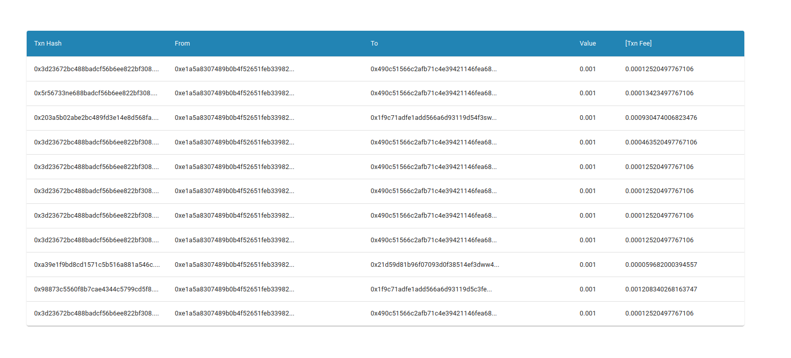

# Unnati

A donation-based  dApp on Polygon where users can start a fundraising project for anyone to contribute and support the campaign by pledging the amount of their wish. 

## Problem
Donors typically have little to no knowledge of how non-profit or philanthropic groups use the money they receive. It is very impossible for donors to tell whether their donations are genuinely having an impact at the grassroots level despite the monthly or yearly reports. We have no useful means of tracking monetary or in-kind donations due to the opaque nature of traditional and centralized charitable institutions. At best, the data we have access to is aggregated and doesn't give us a precise picture of who exactly benefited from our donations or how. According to numerous surveys, the reason why about one-third of people worldwide lack faith in charitable activities is because of their lack of accountability.

## Vision
By creating innovative fundraising technology, we empower people, companies, and nonprofits to support the causes they care about in the moments when they feel inspired and uplift communities everywhere.
We have tried to answer these problems by implementing and using the advantages of blockchain technologies that are key to the surging growth of cryptocurrencies. Here, donors can solely focus on the cause rather than selecting the right organization, and directly transfer the amount to those in need. Crypto philanthropy has switched the donation pattern from organization-specific to cause-centric. This mode of working also ensures that smaller non-profits get equal opportunity to be involved in the process. The transactions done on the blockchain would be traceable. The processing fee are very high on traditional platforms while on Polygon it's negligible.

## The Functionalities

1. **Start New Campaign**  — users will be able to start a new crowdfunding project by inputting some details about the campaign like title, story and goal amount to be raised.
2. **View Projects** — users can see all the existing projects and campaign details on the homepage 
3. **Make Donation** — anyone can fund to the project they want to support in MATIC tokens

## The Tech Stack

- Smart Contract Language: Solidity
- Smart Contract Deploy and Verify Scripts: Javascript
- Smart Contract Development Environment: [Hardhat](https://hardhat.org/)
- Frontend Language: React - TypeScript
- Wallet Connect: [Rainbowkit](https://www.rainbowkit.com/)
- Interacting with Contract through Frontend: [Wagmi](https://wagmi.sh/)
- User Interface: [TailwindCSS](https://tailwindcss.com/)
- RPC provider: [Ankr](https://www.ankr.com/protocol/)

## Screenshots 

## Team : Fousey Gang (Team No 568)
MEMBERS :
- Hardik Bora
- Yash Kataria
- Yash Kamboj
- Vipul Arora
